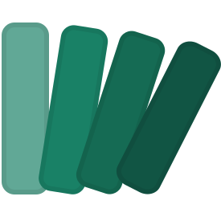

# GrassGrassGrassHopperHopperHopper

A Rhino plugin that brings a **Blender-style modifier stack** to Grasshopper. Stack `.gh` scripts on top of each other, reorder them, tweak parameters, and see geometry update in real time — no manual wiring required.



## What it does

Instead of building one monolithic Grasshopper definition, you write small, focused scripts (modifiers) and layer them in a panel inside Rhino. Geometry flows out of one modifier and into the next automatically, just like mesh modifiers in Blender or Houdini SOPs.

```
[Base Geometry]
      ↓
 [ Extrude  ]  ← tweak Height slider
      ↓
 [SubDivide ]  ← tweak Iterations
      ↓
 [  Twist   ]  ← tweak Angle slider
      ↓
 [  Output  ]
```

Each modifier is a plain `.gh` file that follows a simple naming convention — no custom components or plugins needed to author them.

## Features

- **Modifier stack panel** — add, remove, and reorder `.gh` modifiers on any selected Rhino object
- **Live parameter editing** — sliders, toggles, number inputs, color pickers, and point inputs are surfaced directly in the panel
- **Geometry piping** — geometry passes automatically between modifiers via `GeomIn` / `GeomOut` params
- **Cross-modifier linking** — wire a modifier's output value into a downstream modifier's input
- **Viewport preview** — a display conduit renders the stacked result in real time
- **Per-object stacks** — each Rhino object can carry its own independent modifier stack, stored in document user data

## Getting started

1. Build the solution (`GrassGrassGrassHopperHopperHopper.sln`) targeting Rhino 8.
2. Copy the output `.rhp` to your Rhino plug-ins folder and load it (or run `_PlugInManager`).
3. Select any object — the modifier stack appears as a tab in Rhino's **Object Properties** panel (right sidebar).
4. Add modifiers from the included `.gh` examples and watch the stack evaluate live.

## Writing a modifier

See **[ModifierGuide.md](ModifierGuide.md)** for the full spec. The short version:

- Place a standalone `Geometry` param with NickName `GeomIn` — the engine injects incoming geometry here.
- Put user-facing params inside a group named **Inputs**; their NickNames become the panel labels.
- Put output params inside a group named **Outputs**; a `Geometry` param named `GeomOut` pipes geometry to the next modifier.

```
[Geometry: "GeomIn"]  ──►  [your logic]  ──►  ┌─ Outputs ──────────────┐
                                               │  [Geometry: "GeomOut"] │
┌─ Inputs ──────────────┐                      │  [Number:   "Area"]    │
│  [Number Slider: "H"] │──►  [your logic]     └────────────────────────┘
└───────────────────────┘
```

## Included example modifiers

| File | What it does |
|------|-------------|
| `Extrude.gh` | Extrudes surfaces by a height parameter |
| `Twist.ghx` | Twists geometry around an axis |
| `SubDivide.ghx` | Subdivides mesh faces |
| `SolidDifference.gh` | Boolean-differences a cutter geometry |
| `MakeSurface.gh` | Rebuilds geometry as a surface |
| `CutFloorplates.gh` | Slices geometry into floor plate curves |
| `daylightfactor.gh` | Estimates daylight factor via Ladybug |
| `diamondFacade.gh` | Applies a diamond-panel facade pattern |
| `surfaceBoxing.ghx` | Boxes a surface with parametric frames |

## Commands

| Command | Description |
|---------|-------------|
| `GghRefreshSelectedStack` | Re-runs the stack on the current selection |

## License

MIT
